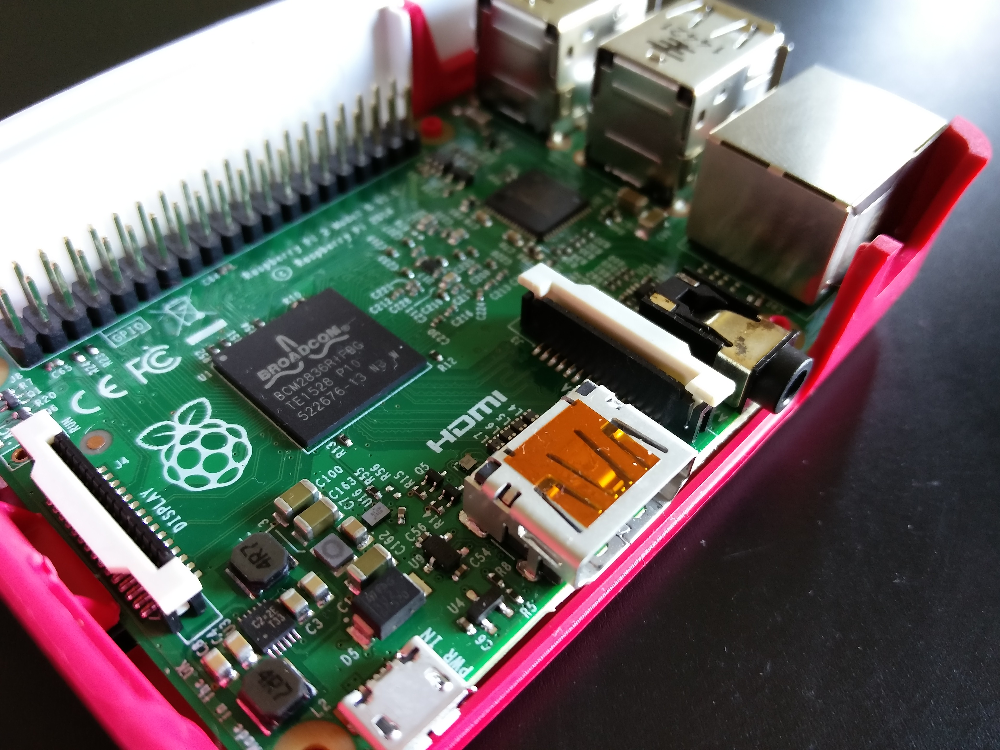
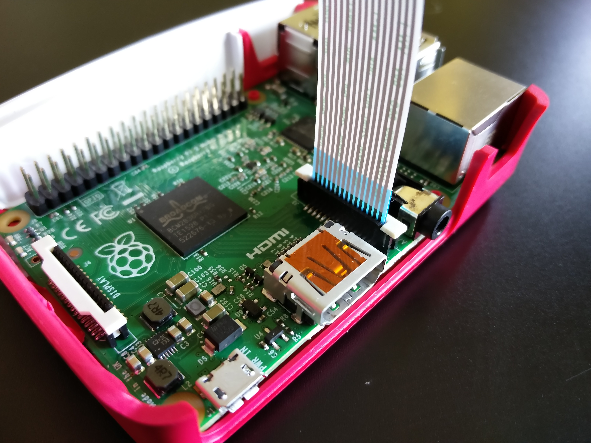
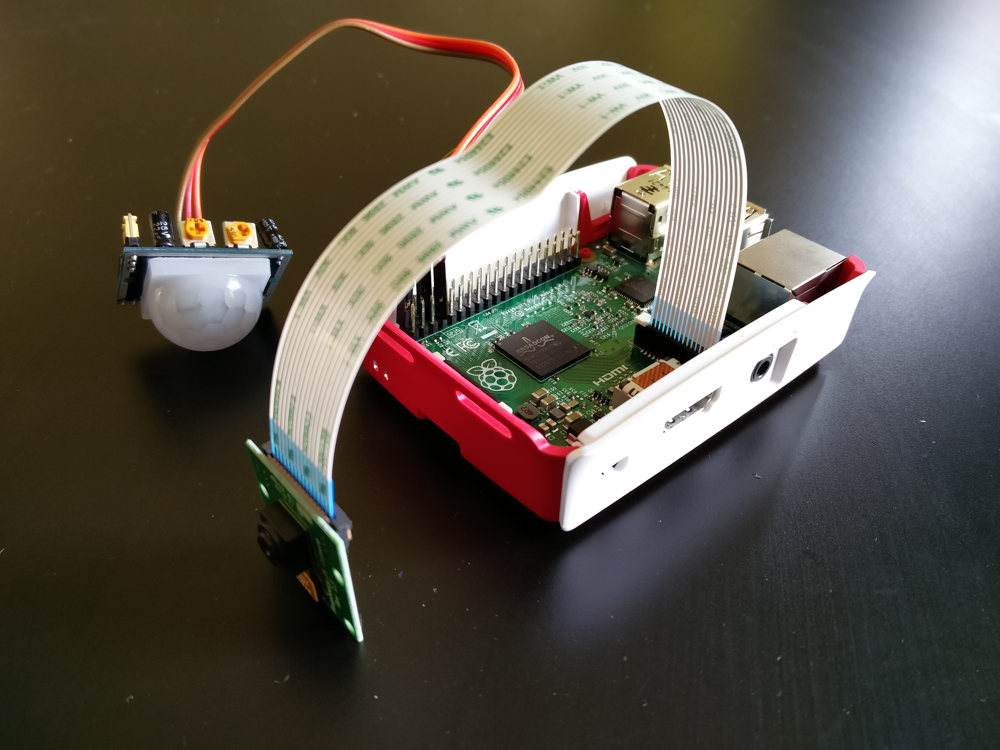

# How to create a Home Security System (CCTV) with a Raspberry Pi, Camera module and PIR sensor.
Having a safe home is an important thing for you and your family. Installing a home security system can be a good option to make your house a little bit safer, but it can also be a very expensive one.  
  
In this tutorial I will show you how to create your own basic security system with a Raspberry Pi, a camera for the Pi and a motion sensor.

## What will it do?
Unlike regular surveillance systems, this project will work a bit different. We will set up the Pi in a way that the PIR sensor (PIR stands for 'Passive Infra Red') recognizes movement and sets of the camera which will make a snapshot of the object that moved. The video captured by the camera will be stored unto the SDcard connected to the Pi.

## Where to start?
Well first you need this stuff to get started:

- Raspberry Pi (1, 2 or 3)
- MicroSD Card with Raspbian installed (8GB Recommended)
- Camera module for Raspberry Pi
- PIR Sensor
- 3 Female/Female GPIO wires
- WiFi USB Adapter (Recommended if you have a Pi 1 or 2. Raspberry Pi 3 has a built in WiFi chip)

I recommend you get a WiFi USB Adapter for the Pi 1 or 2. This way you can set it up anywhere in your house without having to install a long Ethernet cable to the Raspberry Pi.
  
[There is a list of compatible WiFi USB Adapters that work right out of the box with the latest version of Raspbian right here.](http://elinux.org/RPi_USB_Wi-Fi_Adapters)
### Setup your Raspberry Pi
**If you already installed Raspbian or NOOBS onto your Pi, skip this step.**  

First we'll setup your Pi with the needed operating system. The official OS for the Raspberry Pi is an Linux dist called Raspbian. This OS is specifically made for the Pi which ensures it works perfectly with the hardware. 

The OS can be downloaded here:  
[https://www.raspberrypi.org/downloads/noobs/](https://www.raspberrypi.org/downloads/noobs/)

The tutorial for installing the OS onto the Raspberry Pi can be found here:  
[https://www.raspberrypi.org/help/noobs-setup/](https://www.raspberrypi.org/help/noobs-setup/)

Once you got your Raspberry Pi running

### Enable the camera and SSL
Once everything is setup and your Pi is running, we'll proceed with enabling the camera. This is disabled by default so we'll need to enable it first.

SSL is a protocol which enables us to connect to the Pi from a different computer. This saves you all the hassle with connecting a monitor and keyboard to the Pi. So when we need to make a change to change files or settings with our own computer.

Log in with your username and password. If you'll log in with the default username and password, you'll get root access, which is the highest form of access that we need.  

default username = **pi**  
default password = **raspberry**  

Open the Pi configuration tool from the Terminal by typing: 
```sudo raspi-config```  

This will open up a screen which will enable you to make some changes to the Pi' system.  
Select `Enable camera` and hit `Enter`.  
Next up we go to `Enable SSH` and hit `Enter` again. Both are now enabled.
Then select `Finish` and we can continue.

## The Hardware
The camera and ssh are now enabled. Next on we are going to connect our hardware together. You'll need the camera module, PIR sensor and three Female/Female wires.
All of these components are fairly cheap and can be bought in your local hobby show or, ofcourse, the internet.

### Connecting the camera
No we've enabled the camera, we can connect it to the hardware. The camera module is a chip with the camera on it which is connect trough a wire strip. The end of the strip has a blue ribbon with on one side some gold-ish bars. This end goes into the Pi.  

Now the Raspberry Pi has a camera connector which is positioned next to the HDMI and Headphones connectors. It is a black socket with a white lid that you can pull up like this one in the image.


Grab the end of the camera module, lift up the lid of the connector and stick the wire strip into the connector. **The solid blue side has to face the Ethernet connector and the side with the gold-ish bars has to face the HDMI connector.** Make sure the strip is not crooked or slanted. When it is in push down the white lid until it is secured. The camera module should now be connected like in the image below.


The camera has now been connected. Now for the PIR sensor.

### Connecting the PIR sensor
So the PIR sensor takes three wires to connect. The PIR itself has 3 pins:

- `VCC` (Power input)  
- `OUT` (Signal output)  
- `GND` (Ground)

We'll need 3 Female/Female wires to connect the pins of the PIR to the pins of the Pi. The graph below will show you which pins we need to connect on the Pi.


The `5V` pin on the top right corner connects to the `VCC` pin, the `GND` on the Pi to the `GND` on the PIR and the `GP4` pin to the `OUT` pin.  
This should set us up with everything we need for the camera system.

Our setup should look something like this  
  

## The software
Now we've installed all the hardware the time has come to start working on the software.  
We are going to build it with a programming language called [Python](https://www.python.org/).  
It's a strong language which gives us the power to use the hardware on the Pi and make it do what we want. It comes build in with the lastest version of Raspbian.  

We do need a package which gives us controls for the camera.
Go to the terminal and type the following:

```
sudo apt-get update  
sudo apt-get install python3-picamera
```

This will install the necessary updates and package which we need.  

Next we create a folder in which to store the video's that are taken.  
*You can create your own folder or skip this if you don't find it necessary*

```
cd Pictures
mkdir Footage
```

We've created a folder called `Footage`. This way we know where to look when we're trying to get that sneaky bastard.

### Adding the Python
Create a new file  

```
nano security.py
```  

`nano` opens a text editor in which we can create code. We've named the file `security.py`. The `.py` says it's a Python script.  

Now nano has opened we can start typing. We want to import some stuff so we can use that in our script. These things are:

- `RPi.GPIO` for using the pins and the PIR sensor
- `picamera` for giving the camera commands
- `time` so we can create delays
- `datetime` for giving our video files a date

We can collect those packages with an `import` command.  
Type the following in the nano editor  

```
import RPi.GPIO as GPIO
import time
import picamera
import datetime
``` 

Next we create a function which gives us the current time and makes that the video' name.

```
def get_file_name():  # new
    return datetime.datetime.now().strftime("Pictures/Footage/%d-%m-%Y_%H.%M.%S.h264")
```

We've added `Pictures/Footage/` before the name so that the video lands in the `Footage` directory that we've made. The video has an H.264 extention which makes it playable for most video players.

Now for telling the Raspberry Pi which pin to use to receive the information from the PIR sensor we add:

```
sensor = 4
GPIO.setmode(GPIO.BCM)
GPIO.setup(sensor, GPIO.IN, GPIO.PUD_DOWN)
```
It tels the Pi that we use pin #4 for receiving our output which is the same pin we connected the `OUT` to from our PIR sensor.

Time for the camera and some other things. Add the following lines below the previous code.

```
previous_state = False
current_state = False
cam = picamera.PiCamera()
```
We've created two variables `previous_state` and `current_state` which we'll use later to prevent te Pi from taking pictures the whole time.
The third variable `cam` says that whenever we say `cam`, we mean `picamera.PiCamera()`. This is a way to save some lines in the code and makes us efficient.

#### Now for the magic!
If you are familiar with Arduino you might know the `void loop()` function. We are going to make a similar loop which will keep checking if the motion detector has picked up movement. If there is any movement we give the camera the signal to take a video.

We'll create a `while` loop. This loop will continue infinitely until it gets a signal to stop, which we are not going to give.

Add these lines of code under the previous lines.

```
while True:
    cam.vflip = True
    cam.hflip = True
    cam.resolution = (1920, 1080)
    time.sleep(0.1)
    previous_state = current_state
    current_state = GPIO.input(sensor)
    if current_state != previous_state:
        new_state = "HIGH" if current_state else "LOW"
        print("GPIO pin %s is %s" % (sensor, new_state))
        if current_state:
            fileName = get_file_name()
            cam.start_preview()
            cam.start_recording(fileName)
        else:
            cam.stop_preview()
            cam.stop_recording()
```

What have we made here? It starts with the `while` loop which has an argument that says `True`. That means that if it remains `True`, keep on looping.

```
cam.vflip = True
cam.hflip = True
cam.resolution = (1920, 1080)
```
These are the settings for the camera. If your camera is upside down, like mine, you'll want to do `cam.vflip = True` and `cam.hflip = True`. It flips the camera image upside down so it is upright again.  
With `cam.resolution = (1920, 1080)` we set the resolution to full HD. Nice!

```
time.sleep(0.1)
```
`time.sleep(0.1)` gives the loop a delay. The value `(0.1)` says it to wait 100ms before it can check again. This will give the hardware some time to update more consistently before doing something funny.

The rest of the code checks in what state the PIR sensor is (detected or not detected) which fires the rest of the lines.

```
fileName = get_file_name()
cam.start_preview()
cam.start_recording(fileName)
```
The variable `fileName` refers to the function `get_file_name()` which we made higher up in the code. This way we can give it as an input to `cam.start_recording()` so it will store the video to the path and name that `get_file_name()` gave it.

### Result
If you have put all the pieces together it should look like this:

```
import RPi.GPIO as GPIO
import time
import picamera
import datetime

def get_file_name():
    return datetime.datetime.now().strftime("%Y-%m-%d_%H.%M.%S.h264")

sensor = 4
GPIO.setmode(GPIO.BCM)
GPIO.setup(sensor, GPIO.IN, GPIO.PUD_DOWN)

previous_state = False
current_state = False
cam = picamera.PiCamera()

while True:
    cam.vflip = True
    cam.hflip = True
    cam.resolution = (1920, 1080)
    time.sleep(0.1)
    previous_state = current_state
    current_state = GPIO.input(sensor)
    if current_state != previous_state:
        new_state = "HIGH" if current_state else "LOW"
        print("GPIO pin %s is %s" % (sensor, new_state))
        if current_state:
            fileName = get_file_name()
            cam.start_preview()
            cam.start_recording(fileName)
        else:
            cam.stop_preview()
            cam.stop_recording()
```
Now you've got all the stuff! Save it by pressing `CTRL + X`, then `Y` and last `Enter`. We have left the editor and are ready to give it a go.

Type in the following line into the terminal to launch the script we've just made.  

```
sudo python3 security.py
```  

The terminal will give you a message that it has started and that you can exit with `CTRL + C`. Wave your hand in front of the PIR sensor. The terminal will now display some info of the pin output. If the GPIO pin is `HIGH` it has detected movement and will start recording, and `LOW` means it has not detected anything and will stop recording.
If it doesn't do anything or give an error, check the code for errors by reopening the editor with `nano security.py`.

## Retrieving the video
In the script we've told the Pi to store the video into the `Pictures/Footage` folder. But now we want to see what the recordings look like in case we might need them.

To solve this we'll use the SSH we've enabled. This also gives us access to FTP (File Transfer Protocol) in which we can log in to the Pi from our computer and check all the files that we want to see.

We are going to use a FTP-Client to retrieve the video. If you don't have one yet, download [Filezilla](https://filezilla-project.org/).

In Filezilla go to the Sitemanager and create a new site. Fill the fields like so:

- Host: IP-Address of the Pi (example: 192.168.1.65)
- Port: (Leave it blank)
- Protocol: SFTP
- Logintype: Normal
- User: Your Username (default is **pi**)
- Password: Your Password (default is **raspberry**)

And press connect.  
Now find the folder `/home/pi/Pictures/Footage` and you'll see a `.h264` file with a date as name. Download this file to your computer.

### Now let's view the video
I've used VLC Media Player to play `.h254` video's which workes perfectly. You can get it from [here](http://www.videolan.org/vlc/).

**Now open the `.264` file with VLC and watch your intruders.**

### If it doesn't play
That means some settings aren't right in VLC. Go to `preferences` and click on `show all`. Find the `demuxers` item in the menu and select it. You will get a dropdown in which you can select various demuxers. Click on the dropdown and scroll until you find `H264-videodemuxer`. Press `save` and everything is supposed to work. 

## Final steps
We've come a long way to create your own Home Security System. We've prepared your Pi, assembled all of the hardware and written the code to run the camera when motion is detected.

Now that there is left is installing your Pi in an inconspicuous place from where you'll want to record. Set it up and connect the power and internet connection. **(If you use WiFi, scroll to the bottom for the tutorial on how to set it up).**

The Pi has booted up and is ready to receive commands. We'll connect to the Pi from our computer using SSH which we enabled earlier with the following command.

```
ssh@IPaddressOfThePi
sudo python3 security.py
```
Now you're done. You can check the footage anytime you are on the same network as the Pi.


## Adding Wifi (optional)
A tutorial for setting up WiFi on your Pi is down here:
[https://www.raspberrypi.org/documentation/configuration/wireless/wireless-cli.md](https://www.raspberrypi.org/documentation/configuration/wireless/wireless-cli.md)

## References
[NOOBS Download](https://www.raspberrypi.org/downloads/noobs/)  
[NOOBS Setup](https://www.raspberrypi.org/help/noobs-setup/)  
[PIR Installation](http://diyhacking.com/raspberry-pi-gpio-control/)  
[Camera Installation](https://www.raspberrypi.org/documentation/usage/camera/README.md)  
[Code from raspberrypi.org](https://www.raspberrypi.org/learning/parent-detector/worksheet/)
